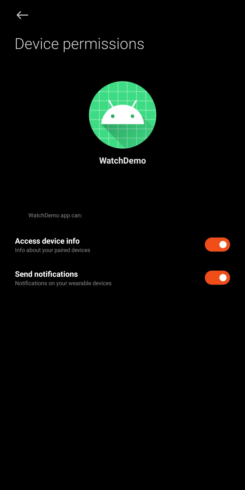

# WatchSDK

仅供学习参考。

小米手环8Pro通信SDK，使用Mi Fitness的XMS_WEARABLE_SERVICE服务实现手机应用与手环的小程序通信。

## 功能

1.发送通知事件。

2.双向数据传输。

## 文件夹说明

js为演示小程序源码，使用release打包。

WatchDemo为Android端演示应用。XiaomiWatchHelper类为作者简单封装的，代码很烂凑合能跑。不建议改动com.xiaomi.xms.wearable下代码数据结构，可能导致与Mi Fitness通信错误。

## 未公开接口

在官方文档中[Iot文档](https://iot.mi.com/vela/quickapp/zh/content/features/network/interconnect.html)中未提及getApkStatus接口

getApkStatus用于在小程序中获取对应Android应用的状态。目前已知返回结果如下表：

| 返回结果 | 说明 |
|:-------:|:-------:|
| "UNINSTALLED" | 目标应用未安装 |
| "CONNECTED" | 已连接目标应用 |
| "DISCONNECTED" | 目标应用连接断开 |
| 其它(未知) | 检查超时 |

## 注意

小程序打包使用的包名和签名必须与Android应用包名和签名一致才能进行通信。

遇到权限拒绝时检查是否授权第三方权限。使用[Wearable-Debug](https://github.com/A5245/Wearable-Debug)插件后打开go third app list授权。需要先安装小程序并Android应用请求一次权限后Mi Fitness才会创建权限控制项。Mi Fitness会默认授权全部请求的权限，注意使用Android应用来源。

  

